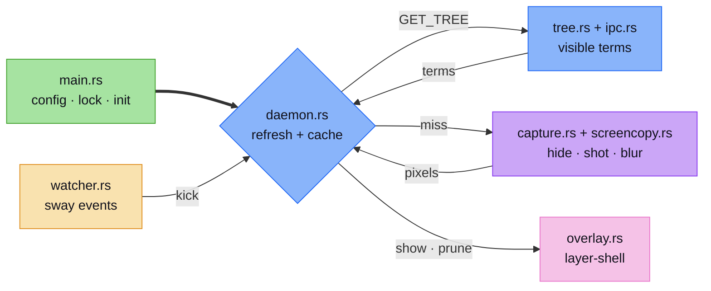

<h1 align="center">sway-blur</h1>
<p align="center">
  <strong>Snapshot blur overlay behind transparent windows on Sway</strong>
  <br />
  <em>blur · rust</em>
</p>

<p align="center">
  <a href="#quick-start"></a>
  <a href="#tech-stack"></a>
</p>

<p align="center">
  
  
  
  
  
</p>


## Features

- Blur
- Easy to config

## Quick Start

### Install (one-liner)

```bash
curl -fsSL https://raw.githubusercontent.com/developic/sway-blur/main/install.sh | bash
```
### Install from source

#### Prerequisites

- Sway (wlroots with `zwlr_screencopy_v1`)
- GTK 3, gtk-layer-shell
- Rust toolchain

### Install

```bash
cargo build --release
sudo install -m 0755 target/release/sway-blur /usr/local/bin/
```

### Configure

```bash
mkdir -p ~/.config/sway-blur
cp config.example.toml ~/.config/sway-blur/config.toml
```

### Run

```bash
./target/release/sway-blur
```

## Usage

Autostart in sway config:

```sway
exec_always sway-blur
```

## How things work



## Configuration

```text
$HOME/.config/sway-blur/config.toml
```

| Key | Default | Description |
|---|---|---|
| `allowlist_app_ids` | ghostty, Alacritty, kitty, foot | Windows treated as transparent |
| `blur` | 2.0 | Blur strength |
| `downscale` | 8 | Pre-blur shrink factor |
| `tint` | 0.0 | Dark tint, 0–100 |
| `debounce_ms` | 150.0 | Event coalesce window |
| `hide_settle_ms` | 25.0 | Settle wait after hiding before capture |
| `revalidate_ms` | 1000.0 | Timer re-check cadence, 0 = off |
| `snapshot_cache_max` | 16 | Snapshots kept |

## Tech Stack

| Layer | Technology |
|---|---|
| Language | Rust 2021 |
| UI | GTK 3, gtk-layer-shell, gdk-pixbuf |
| Wayland | wayland-client, wayland-protocols, wlr-screencopy |
| Image | image, fast_image_resize, memmap2 |
| IPC/Config | serde_json, toml, anyhow, fs2, rustix |

## Contributing

1. Fork the repository
2. Create a feature branch (`git checkout -b feature/amazing`)
3. Commit your changes (`git commit -m 'feat: add amazing feature'`)
4. Push to the branch (`git push origin feature/amazing`)
5. Open a Pull Request

## License

MIT — see [LICENSE](LICENSE).
